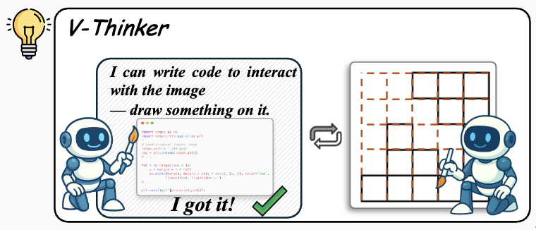
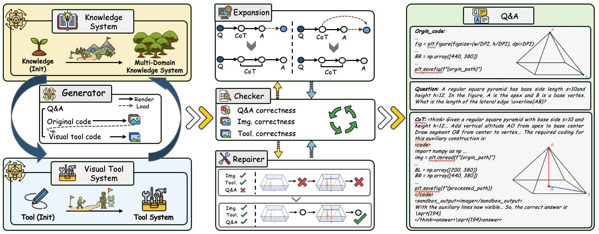
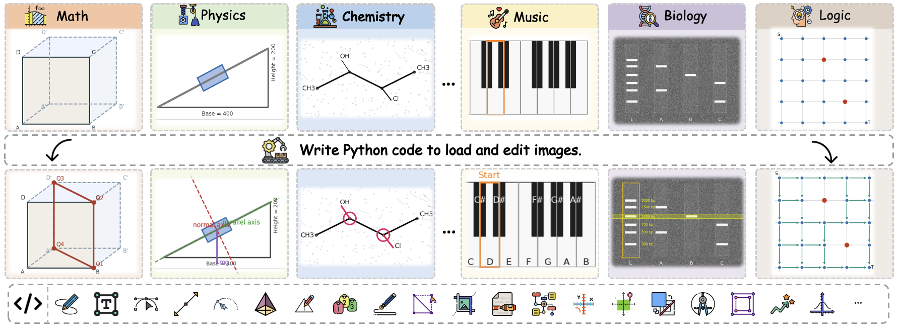
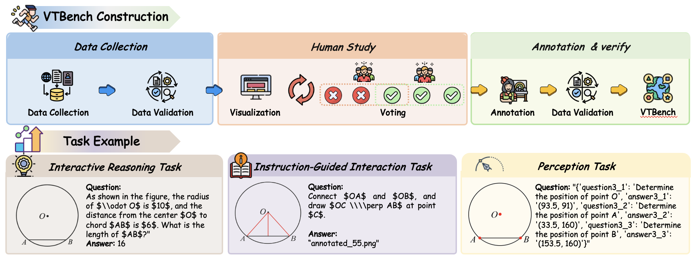
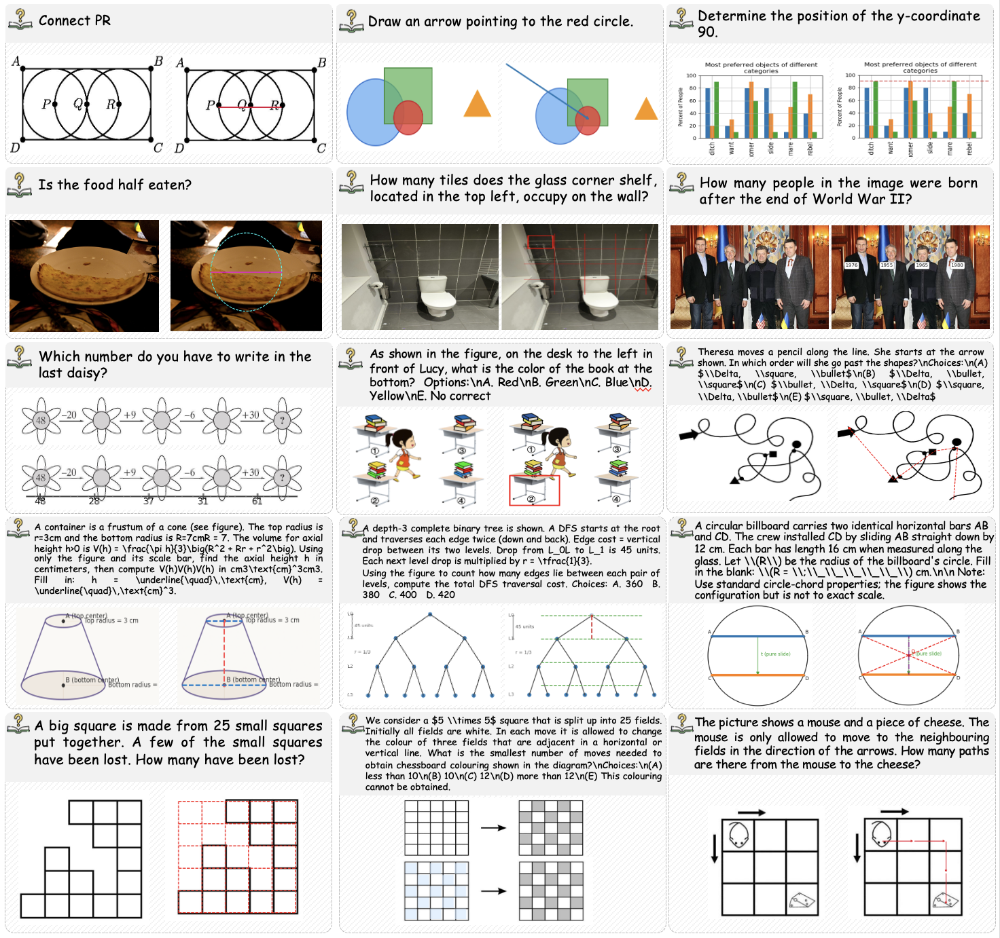
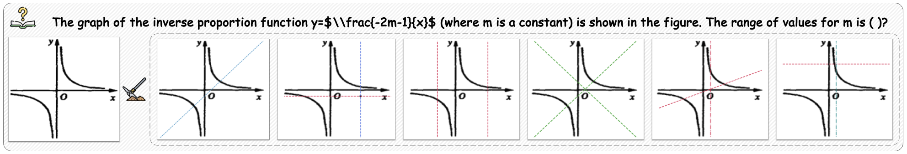
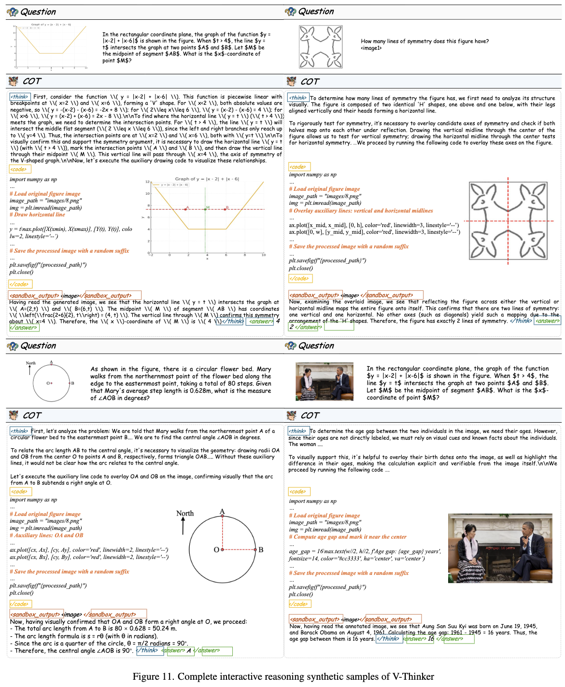
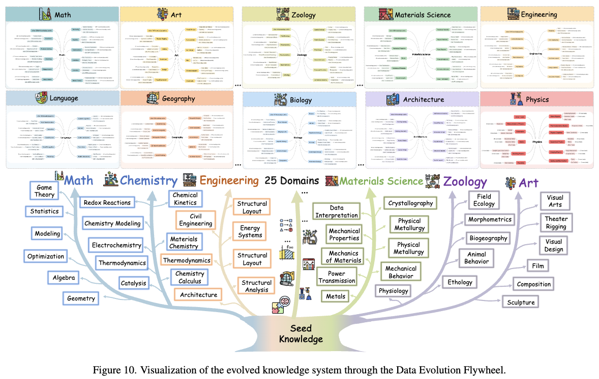

<div align="center">

</div>
<h1 align="center">✨ V-Thinker: Interactive Thinking with Images</h1>

<div align="center">

[](https://arxiv.org/abs/XXXX.XXXXX)
[](https://huggingface.co/datasets/We-Math/V-Thinker)
[](https://opensource.org/licenses/MIT)
[](https://www.python.org/downloads/release/python-3100/)

</div>

<h5 align="center">If you like our project, please give us a star ⭐ on GitHub for the latest update.</h5>

<div align="center">
  
</div>

---

## 📣 Latest News

- **[Nov 6, 2026]**: 🚀 V-Thinker codebase and datasets released!
- **[Nov 6, 2026]**: 📄 Our paper is now available on arXiv.
- **[Nov 6, 2026]**: 🎯 Introduced **VTBench**, an expert-verified benchmark for vision-centric interactive reasoning.

---

## 📂 Datasets

| Dataset | Description | Size | Download |
|---------|-------------|------|----------|
| **V-Interaction-400K** | Interactive reasoning with 25+ domains | 400K | [🤗 HuggingFace](https://huggingface.co/datasets/We-Math/V-Interaction-400K) |
| **V-Perception-40K** | Point-level perception alignment | 40K | [🤗 HuggingFace](https://huggingface.co/datasets/We-Math/V-Perception-40K) |
| **VTBench** | Expert-verified interactive benchmark | 1.5K | [🤗 HuggingFace](https://huggingface.co/datasets/We-Math/VTBench) |


---

## 💡 Overview

> *"The soul never thinks without an image." — Aristotle*

**V-Thinker** is a general-purpose multimodal reasoning assistant that enables **Interactive Thinking with Images** through end-to-end reinforcement learning. Unlike traditional vision-language models, V-Thinker actively **interacts** with visual content—editing, annotating, and transforming images to simplify complex problems.



---

## ✨ Key Features

### 🔄 Data Evolution Flywheel

Automated synthesis of high-quality interactive reasoning data across three dimensions:

- **Diversity**: Knowledge-driven synthesis from 25+ domains → **22,319 nodes** across 7 layers
- **Quality**: Coordinated checker-repairer mechanism for multi-modal consistency
- **Difficulty**: Progressive expansion via parallel & sequential strategies

**Outputs**: 
- 📊 **V-Interaction-400K**: Large-scale interactive reasoning dataset
- 🎯 **V-Perception-40K**: Point-level perception alignment dataset

---

### 📚 Visual Progressive Training Curriculum

Two-stage framework progressively building perception and interactive reasoning:

**Stage 1: Perception Alignment** → Fine-grained visual grounding with point-level supervision

**Stage 2: Interactive Reasoning** → Cold-start SFT + RL in sandboxed code executor

---

## 🎬 Interactive Image Examples



---

## 📊 VTBench Benchmark

Expert-verified benchmark with **1,500 QA pairs** across three hierarchical dimensions:



| Metric | Specification |
|--------|---------------|
| **Samples** | 1,500 expert-verified pairs (500 per task type) |
| **Sources** | 9 open-source benchmarks |
| **Domains** | Logical Reasoning, Geometry, Algebra, Statistics |


## 🚀 Quick Start

### Installation

```bash
conda create -n vthinker python=3.10
conda activate vthinker
pip install -e .
```

### Training
Download the perception dataset ([V-Perception-40K](https://huggingface.co/datasets/We-Math/V-Perception-40K)), SFT dataset ([V-Interaction-400K](https://huggingface.co/datasets/We-Math/V-Interaction-400K)),  RL dataset ([WeMath 2.0](https://huggingface.co/datasets/We-Math/V-Interaction-400K), [MMK12](https://huggingface.co/datasets/FanqingM/MMK12), [ThinkLite](https://huggingface.co/datasets/russwang/ThinkLite-VL-hard-11k)) to the data folder and modify the image path as needed to match your coding environment.

Please ensure you have modified the model and dataset paths in the script to match your environment.
```bash
# Perception Alignment
sh scripts/perception.sh
```
```bash
# Interactive Reasoning (SFT + RL).
sh scripts/sft.sh
sh scripts/rl.sh
```

### Inference
Environment setup for eval
```bash
pip install --upgrade vllm
```
Download the [VTBench](https://huggingface.co/datasets/We-Math/VTBench) to the data folder and corresponding images to the eval/vtbrnch_IP, eval/vtbrnch_IGI, eval/vtbrnch_Perception folder.

Please ensure you have modified the model paths in the script to match your environment.
```bash
# Run on VTBench
cd eval/vtbrnch_IP
sh run.sh
```
Download the [MathVison](https://huggingface.co/datasets/We-Math/VTBench), [WeMath](https://huggingface.co/datasets/We-Math/VTBench), [Visulogic](https://huggingface.co/datasets/We-Math/VTBench) to the data folder and modify the image path as needed to match your coding environment.

For Visulogic, you also need to download the corresponding [Visulogic images](https://huggingface.co/datasets/We-Math/VTBench) to the eval/visulogic folder.
```bash
# Run on general benchmarks
cd eval/mathvision
python src/run_vthinker.py --benchmark mathvision --eval
```

---

## 🏆 Performance Results

### VTBench Results

| Model | Perception | Instruction-Guided | Interactive Reasoning |
|-------|------------|-------------------|----------------------|
| GPT-4o | 2.3 | 3.7 | 38.3 |
| InternVL3-78B | 10.8 | 16.0 | 43.4 |
| Qwen2.5-VL-7B | 9.6 | 8.8 | 32.2 |
| **V-Thinker-7B** | **18.0** (+8.4) | **34.6** (+25.8) | **41.8** (+9.6) |

### General Reasoning Benchmarks

| Model | MathVision | We-Math | VisuLogic |
|-------|------------|---------|-----------|
| Qwen2.5-VL-7B | 23.0 | 61.7 | 26.0 |
| **V-Thinker-7B** | **29.3** (+6.3) | **62.8** (+1.1) | **26.6** (+0.6) |

---

## 🔬 Case Studies







## 🔬 Evovled Knowledge System



---

## 📄 Citation

```bibtex
@article{vthinker2026,
  title={V-Thinker: Interactive Thinking with Images},
  author={Qiao, Runqi and Tan, Qiuna and Yang, Minghan and others},
  journal={arXiv preprint arXiv:XXXX.XXXXX},
  year={2026}
}
```

---

## 📞 Contact

**Email**: qrq@bupt.edu.cn, qiunatan@bupt.edu.cn  
**Issues**: [GitHub Issues](https://github.com/We-Math/V-Thinker/issues)

---

## 📄 License

This project is released under the [MIT License](LICENSE).

---

[](https://www.star-history.com/#We-Math/V-Thinker&Date)

<div align="center"><b>⭐ Star us on GitHub to stay updated! ⭐</b></div>
