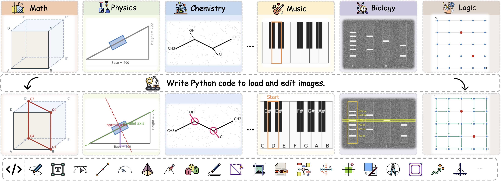
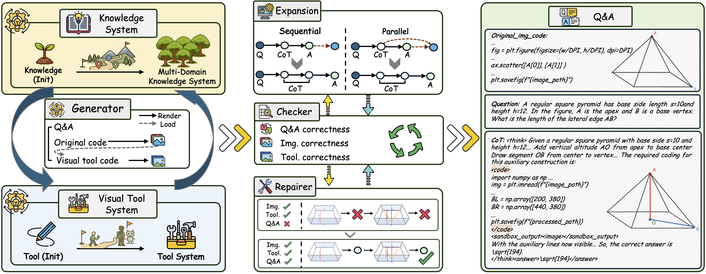
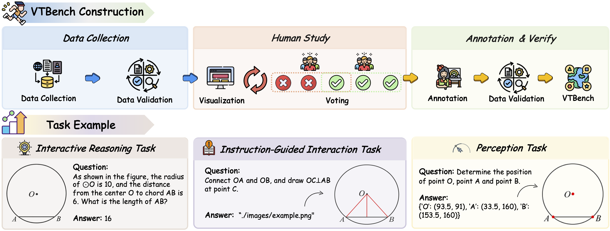

<div align="center">
  
</div>

<div align="center">

[](https://arxiv.org/pdf/2511.04460)
[](https://huggingface.co/datasets/We-Math/V-Thinker)
[](https://opensource.org/licenses/MIT)
[](https://www.python.org/downloads/release/python-3100/)
 


</div>

---

<h5 align="center">If you like our project, please give us a star ⭐ on GitHub for the latest update.</h5>

<div align="center">
  
</div>

<div align="center">
🤗 <a href="https://huggingface.co/datasets/We-Math/V-Interaction-400K" target="_blank">V-Interaction-400K</a> ｜
🤗 <a href="https://huggingface.co/datasets/We-Math/VTBench" target="_blank">VTBench</a> ｜
🤗 <a href="https://huggingface.co/We-Math/V-Thinker" target="_blank">Models(V-Thinker)</a> ｜
🤗 <a href="https://huggingface.co/datasets/We-Math/V-Perception-40K" target="_blank">V-Perception-40K</a>
</div>

---


## 📣 Latest News

- **[Nov 7, 2026]**: 🔥 We released [**V-Interaction-400K**](https://huggingface.co/datasets/We-Math/V-Interaction-400K) *(preview version, containing 252K samples)* — a large-scale, high-quality visual interaction dataset which can also be extended to image-to-code tasks.  
- **[Nov 7, 2026]**: 🔥 We released [**V-Perception-40K**](https://huggingface.co/datasets/We-Math/V-Perception-40K) *(preview version, containing 37K samples)* — a high-quality dataset for point-level perceptual alignment.  
- **[Nov 7, 2026]**: 🔥 We released [**VTBench**](https://huggingface.co/datasets/We-Math/VTBench), a standardized benchmark for interactive visual reasoning across three task types — Perception, Instruction-Guided Interaction, and Interactive Reasoning.
- **[Nov 7, 2026]**: 📄 Our paper is now available on [**arXiv**](https://arxiv.org/abs/2511.04460) and Hugging Face daily paper.


---
## :mag_right: Roadmap
**🛠️ V-Thinker is still evolving!**

V-Thinker is still under development and there are many issues and room for improvement. We will continue to update. And we also sincerely welcome contributions on this open-source toolkit.
- [x] Release codebase and datasets *(preview version 252K+37K)*.
- [x] Release V-Thinker-7B.
- [x] Release VTBench.
- [ ] Release knowledge system and visual tool system.
- [ ] Release the complete version of datasets (planned before December).
- [ ] Release improved checkpoints.

---

## 📑 Contents

> [!NOTE]
> Quick navigation guide for exploring **V-Thinker**

- [💡 Overview](#-overview)
- [🚀 Quick Start](#-quick-start)
- [🏆 Experiments Results](#-experiments-results)
- [📄 Citation](#-citation)
- [🤝 Acknowledge](#-acknowledge)
- [📞 Contact](#-contact)


---

## 💡 Overview


**V-Thinker** is a general-purpose multimodal reasoning assistant that enables **Interactive Thinking with Images** through end-to-end reinforcement learning. Unlike traditional vision-language models, V-Thinker actively **interacts** with visual content—editing, annotating, and transforming images to simplify complex problems.


### 📂 Datasets


<div align="center">

| Dataset | Description | Download |
|---------|-------------|----------|
| **V-Interaction-400K** | Large-scale interactive reasoning dataset | [🤗 HuggingFace](https://huggingface.co/datasets/We-Math/V-Interaction-400K) |
| **V-Perception-40K** | Point-level perception alignment dataset | [🤗 HuggingFace](https://huggingface.co/datasets/We-Math/V-Perception-40K) |
| **VTBench** | Expert-verified interactive benchmark | [🤗 HuggingFace](https://huggingface.co/datasets/We-Math/VTBench) |

</div>


<div align="center">

</div>


### 💡 Rethinking the Data Synthesis Paradigm

We rethink the traditional data synthesis paradigm by transforming models from **"solvers"** to **"creators"**, enabling them to directly generate high-quality multimodal reasoning data through code-level rendering and reasoning generation. Furthermore, by leveraging knowledge-driven representations, structured knowledge systems guide models to produce diverse, coherent, and spatially aligned problems, expanding the scope and evolution of reasoning data.


### 🔄 Data Evolution Flywheel

Automated synthesis of high-quality interactive reasoning data across three dimensions:

- **Diversity**: Knowledge-driven synthesis from seed concepts ([We-Math2.0](https://we-math2.github.io/)) expanding to 25 domains and 24,767 nodes, enabling continuous evolution from data expansion to genuine data creation.
- **Quality**: A coordinated checker–repairer mechanism ensures cross-modal consistency and high fidelity across textual, visual, and image-action dimensions.
- **Difficulty**: A progressive expansion stage enriches the difficulty ladder through parallel and sequential extension strategies, supporting scalable reasoning complexity.

<div align="center">

</div>


### 📚 Visual Progressive Training Curriculum

Two-stage framework progressively building perception and interactive reasoning:

**Stage 1: Perception Alignment** → Fine-grained visual grounding with point-level supervision

**Stage 2: Interactive Reasoning** → Cold-start SFT + RL in sandboxed code executor.


### 📊 VTBench Benchmark

Expert-verified benchmark with **1,500 QA pairs** across three hierarchical dimensions:

<div align="center">


| Task | Specification |
|--------|---------------|
| **Perception** | Visual grounding via coordinate prediction and rendering. |
| **Instruction-Guided Interaction** | Visual editing and manipulation from instructions. |
| **Interactive Reasoning** | Multimodal reasoning and answer generation. |

</div>

---

## 🚀 Quick Start

### Installation

```bash
conda create -n vthinker python=3.10
conda activate vthinker
pip install -e .
```
### Usage Example: How to use V-Thinker
We provide a simple script (eval/vtbench_IR/inference.py) to inference on custom cases. Simply run:
```bash
cd ./eval/vtbench_IR
python inference.py
```

### Training
Download the perception dataset ([V-Perception-40K](https://huggingface.co/datasets/We-Math/V-Perception-40K)), SFT dataset ([V-Interaction-400K](https://huggingface.co/datasets/We-Math/V-Interaction-400K)),  RL dataset ([WeMath 2.0](https://huggingface.co/datasets/We-Math/V-Interaction-400K), [MMK12](https://huggingface.co/datasets/FanqingM/MMK12), [ThinkLite](https://huggingface.co/datasets/russwang/ThinkLite-VL-hard-11k)) to the data folder and modify the image path as needed to match your coding environment.

Please ensure you have modified the model and dataset paths in the script to match your environment.
```bash
# Perception Alignment
sh scripts/perception.sh
```
```bash
# Interactive Reasoning (SFT + RL).
sh scripts/sft.sh
sh scripts/rl.sh
```

### Inference
Environment setup for eval
```bash
pip install --upgrade vllm
```
Download the [VTBench](https://huggingface.co/datasets/We-Math/VTBench) to the data folder and corresponding images to the `eval/vtbench_IR`, `eval/vtbench_IGI`, `eval/vtbench_Perception` folder.

Please ensure you have modified the model paths in the script to match your environment.
```bash
# Run on VTBench
cd eval/vtbench_IR
sh run.sh
```
Download the [MathVison](https://huggingface.co/datasets/We-Math/VTBench), [WeMath](https://huggingface.co/datasets/We-Math/We-Math), [VisuLogic](https://huggingface.co/datasets/VisuLogic/VisuLogic/tree/main) to the data folder and modify the image path as needed to match your coding environment.

For Visulogic, you also need to download the corresponding [VisuLogic images](https://huggingface.co/datasets/VisuLogic/VisuLogic) to the `eval/visulogic` folder.
```bash
# Run on general benchmarks
cd eval/mathvision
python src/run_vthinker.py --benchmark mathvision --eval
```

---

## 🏆 Experiments Results

> ### Quantitative Results On VTBench


<div align="center">
 
| Model | Perception | Instruction-Guided | Interactive Reasoning |
|-------|------------|-------------------|----------------------|
| GPT-4o | 2.3 | 3.7 | 38.3 |
| InternVL3-78B | 10.8 | 16.0 | 43.4 |
| Qwen2.5-VL-7B | 9.6 | 8.8 | 32.2 |
| **V-Thinker-7B** | **18.0** (+8.4) | **34.6** (+25.8) | **41.8** (+9.6) |

</div>


> ### Qualitative Results
<details>
  <summary><b>Qualitative Analysis</b></summary>
  <div align="center">
    
  </div>
</details>

<details>
  <summary><b>Rollout Sampling</b></summary>
  <div align="center">
    
  </div>
</details>

<details>
  <summary><b>CoT</b></summary>
  <div align="center">
    
  </div>
</details>

<details>
  <summary><b>Evovled Knowledge System</b></summary>
  <div align="center">
    
  </div>
</details>


---

## 📄 Citation

```bibtex
@misc{qiao2025vthinker,
      title={V-Thinker: Interactive Thinking with Images}, 
      author={Runqi Qiao and Qiuna Tan and Minghan Yang and Guanting Dong and Peiqing Yang and Shiqiang Lang and Enhui Wan and Xiaowan Wang and Yida Xu and Lan Yang and Chong Sun and Chen Li and Honggang Zhang},
      year={2025},
      eprint={2511.04460},
      archivePrefix={arXiv},
      primaryClass={cs.CV},
      url={https://arxiv.org/abs/2511.04460}, 
}

```

---

## 🤝 Acknowledge

This training implementation builds upon [**Thyme**](https://github.com/yfzhang114/Thyme) and [**Swift**](https://github.com/modelscope/swift), while our models are trained using [**Qwen2.5-VL**](https://github.com/QwenLM/Qwen2.5-VL). For evaluation, we rely on [**MathVision**](https://huggingface.co/datasets/MathLLMs/MathVision), [**We-Math**](https://huggingface.co/datasets/We-Math/We-Math), [**VisuLogic**](https://huggingface.co/datasets/VisuLogic/VisuLogic), and [**VLMEvalKit**](https://github.com/open-compass/VLMEvalKit). For the GRPO-stage data, we sincerely thank [**We-Math 2.0**](https://huggingface.co/datasets/We-Math/We-Math2.0-Standard), [**MM-Eureka**](https://huggingface.co/datasets/FanqingM/MMK12), and [**ThinkLite**](https://huggingface.co/collections/russwang/thinklite-vl) for their open contributions. We express our sincere gratitude to these projects for their invaluable contributions to the open-source community.


---

## 📞 Contact

For any questions or feedback, please reach out to us at qrq@bupt.edu.cn or qiunatan@bupt.edu.cn.

---

## 📄 License

This project is released under the [MIT License](LICENSE).

